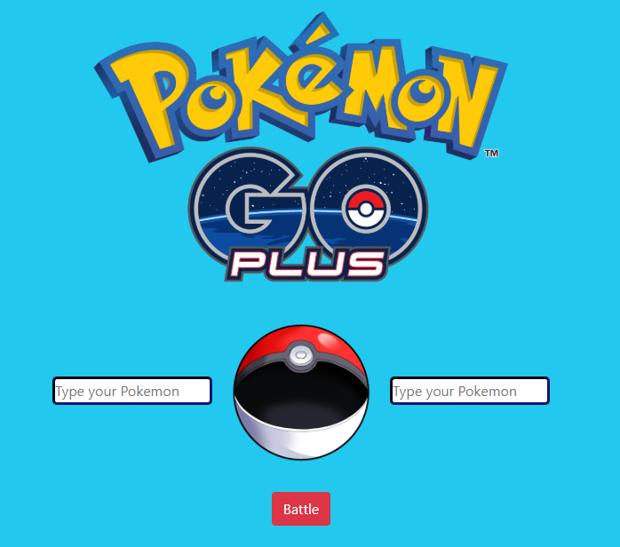
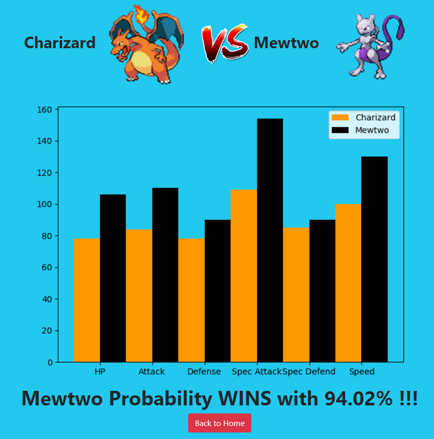
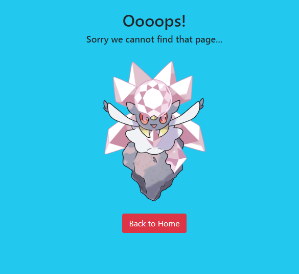
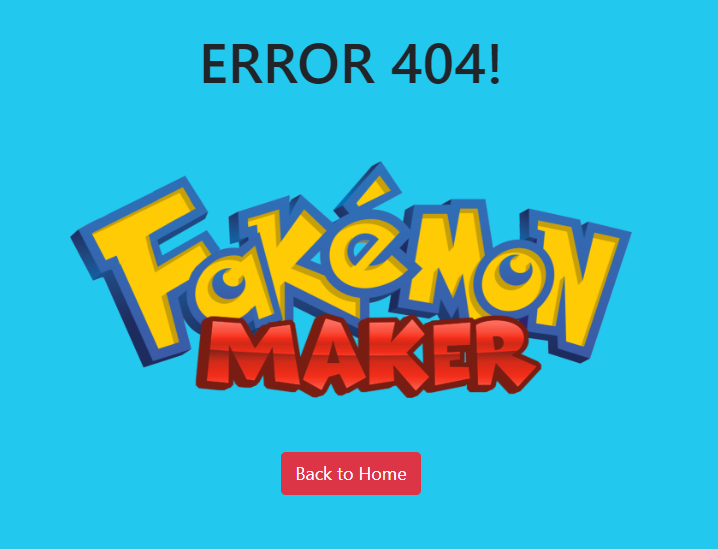

# POKEMON BATTLE

                 

Provided __several datasets__ about Pokemon species data about the history of matches between Pokemon. File **_pokemon.csv_** contains complete data of 800 Pokemon species, while file **_combats.csv_** contains historical data of the Pokemon duel with the winner.
Source: [click here](https://www.kaggle.com/sekarmg/pokemon).

Dengan dataset tersebut, buatlah sebuah __aplikasi Flask__ berisi model machine learning (model bebas) yang dapat memprediksi pemenang dari duel Pokemon. Aplikasi yang dibuat harus memenuhi syarat minimal berikut:

With this dataset, I created a Flask application containing a _Gradient Boost Classifier_ Machine Learning model that can predict the winner of a Pokemon duel. Following below are the description:

1. The application server will run on __localhost: 2070__ and when the user makes a GET request via the browser a simple __HTML__ page will appear containing __2 inputs text__ and __a button__. Users can enter the name of the Pokemon that will be contested in the available text input. When the user presses the __'Battle!'__ button, the application will process the data entered by the user.

    
 
2. If the data is successfully processed, then the user will be _redirect_ to __localhost: 2070 / result__ containing a __HTML__ page that displays:

    - __Pokemon Picture__
        - Use __Poke API__ ([_click here_](https://pokeapi.co/))
        - __GET__ to ([__click here__](https://pokeapi.co/api/v2/pokemon/{Pokemon_Name}))

    - __Pokemon skill__ comparison chart (from the dataset):
        - HP 
        - Attack 
        - Defense 
        - Special Attack
        - Special Defense 
        - Speed

    - __Possible Winners__ along with __percentage (%) probability__

    This page also includes __a button__ to return to the start page. The design of HTML display doesn't have to be the same as the example problem, prioritize features! Example:

     __Charizard vs Mewtwo__ 

    
    
3. But if the data is not found, there is not in the dataset. the user enters a url that is not available, then the user will be redirected to the __HTML__ page which provides information that the data is not found. This page also includes __a button__ to return to the start page.

    

4. And if the user enters a url that is not available, then the user will be redirected to the __HTML__ page which provides information __ERROR 404__. This page also includes __a button__ to return to the start page.

    

                 

> **Note**: For further discussion if you have questions, criticisms, and suggestions, feel free to contact my email: kusumardanar@gmail.com. 
 

## __THANK YOU__
